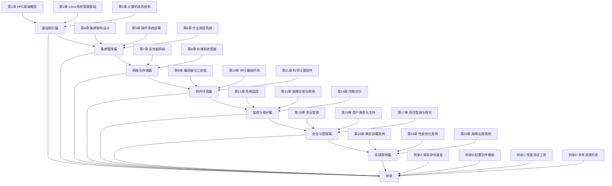

# 学习路径图

## 🎯 总体学习路径



## 📚 分阶段学习计划

### 🟢 初级阶段（3-6个月）

**学习目标**：掌握HPC基础概念和Linux系统管理技能

**时间安排**：
- 第1-2周：学习第1章，理解HPC基本概念
- 第3-4周：学习第2章，掌握Linux基础操作
- 第5-6周：学习第3章，了解计算机体系结构
- 第7-8周：实践Linux系统安装和基础配置
- 第9-12周：深入学习网络配置和存储管理基础

**关键技能**：
- ✅ Linux命令行操作
- ✅ 用户和权限管理
- ✅ 网络基础配置
- ✅ 文件系统管理
- ✅ 基础故障排除

**实践项目**：
- 搭建Linux实验环境
- 配置多节点SSH互信
- 实现简单的文件共享
- 基础网络故障诊断

### 🟡 中级阶段（6-12个月）

**学习目标**：掌握集群管理、作业调度和存储系统

**时间安排**：
- 第1-2月：学习第4-5章，掌握集群架构和系统部署
- 第3-4月：学习第6章，精通作业调度系统
- 第5-6月：学习第7-8章，掌握网络和存储管理
- 第7-8月：实践集群部署和配置
- 第9-10月：深入学习监控和故障处理

**关键技能**：
- ✅ 集群架构设计
- ✅ 批量系统部署
- ✅ SLURM/PBS调度器配置
- ✅ 并行文件系统管理
- ✅ 网络性能优化

**实践项目**：
- 部署5节点小型HPC集群
- 配置SLURM作业调度系统
- 搭建Lustre并行文件系统
- 实现集群监控系统

### 🔴 高级阶段（12-24个月）

**学习目标**：精通性能优化、安全管理和项目规划

**时间安排**：
- 第1-3月：学习第9-11章，掌握软件环境配置
- 第4-6月：学习第12-14章，精通监控和优化
- 第7-9月：学习第15-17章，掌握安全和管理
- 第10-12月：学习第18-20章，积累实践经验
- 第13-24月：参与实际项目，积累实战经验

**关键技能**：
- ✅ 编译器和工具链优化
- ✅ MPI/OpenMP并行编程环境
- ✅ 性能分析和优化
- ✅ 安全策略制定
- ✅ 项目规划和管理

**实践项目**：
- 优化现有HPC集群性能
- 设计安全策略和备份方案
- 规划中型HPC中心建设
- 编写技术文档和培训材料

## 🛠️ 实践环境搭建

### 实验环境要求

**最低配置**（适合学习基础）：
```
物理机/虚拟机：3-5台
CPU：2核/台
内存：4GB/台
存储：50GB/台
网络：千兆以太网
操作系统：CentOS Stream 9
```

**推荐配置**（适合深入学习）：
```
物理机/虚拟机：8-10台
CPU：4核/台
内存：8GB/台
存储：100GB/台
网络：千兆以太网
操作系统：CentOS Stream 9
```

**高级配置**（适合性能优化）：
```
物理机：10-20台
CPU：8核/台
内存：16GB/台
存储：500GB SSD/台
网络：万兆以太网
GPU：可选（用于CUDA学习）
```

### 虚拟化方案

**VMware Workstation**：
```bash
# 适合Windows/Mac用户
# 支持快照、克隆等功能
# 网络配置灵活
# 推荐配置：4核CPU，8GB内存，100GB存储
```

**VirtualBox**：
```bash
# 免费开源
# 跨平台支持
# 基本功能齐全
# 推荐配置：2核CPU，4GB内存，50GB存储
```

**KVM/QEMU**：
```bash
# Linux原生虚拟化
# 性能优秀
# 适合服务器环境
# 支持高级网络配置
```

**云服务器**：
```bash
# 阿里云、腾讯云、华为云
# 按需使用，成本可控
# 网络环境稳定
# 推荐配置：2核4GB，按量付费
```

### 容器化方案

**Docker**：
```bash
# 快速部署测试环境
# 资源占用少
# 易于管理和分发

# 示例：快速部署SLURM
docker run -d --name slurm slurm/slurm

# 示例：部署OpenMPI环境
docker run -it --rm openmpi/openmpi:latest
```

**Singularity**：
```bash
# HPC环境专用
# 安全性高
# 与HPC环境兼容性好

# 示例：运行Singularity容器
singularity run container.sif
```

### 章节实践环境对应表

| 章节 | 所需环境 | 最低配置 | 推荐配置 | 实践内容 |
|------|----------|----------|----------|----------|
| 第2章 Linux系统管理 | 单机Linux | 1台/2核/4GB | 1台/4核/8GB | 用户管理、网络配置 |
| 第3章 计算机体系结构 | 性能测试 | 1台/4核/8GB | 2台/8核/16GB | CPU/内存/存储测试 |
| 第4章 集群架构设计 | 多节点集群 | 3台/2核/4GB | 5台/4核/8GB | 集群拓扑设计 |
| 第5章 操作系统部署 | 批量部署 | 5台/2核/4GB | 8台/4核/8GB | PXE安装、自动化部署 |
| 第6章 作业调度系统 | 调度器集群 | 5台/2核/4GB | 8台/4核/8GB | SLURM/PBS配置 |
| 第7章 高性能网络 | 网络测试 | 3台/4核/8GB | 5台/8核/16GB | 网络性能测试 |
| 第8章 存储系统管理 | 存储集群 | 3台/4核/8GB | 5台/8核/16GB | Lustre/GPFS搭建 |
| 第9章 编译器与工具链 | 编译环境 | 1台/4核/8GB | 2台/8核/16GB | 编译器安装和优化 |
| 第10章 并行编程环境 | MPI环境 | 3台/4核/8GB | 5台/8核/16GB | MPI/OpenMP测试 |
| 第11章 科学计算软件 | 软件环境 | 1台/4核/8GB | 2台/8核/16GB | 软件安装和容器化 |
| 第12章 系统监控 | 监控集群 | 5台/2核/4GB | 8台/4核/8GB | 监控系统部署 |
| 第13章 故障诊断 | 故障模拟 | 3台/2核/4GB | 5台/4核/8GB | 故障注入和诊断 |
| 第14章 性能优化 | 优化测试 | 3台/4核/8GB | 5台/8核/16GB | 性能基准测试 |
| 第15章 安全管理 | 安全测试 | 2台/2核/4GB | 3台/4核/8GB | 安全策略实施 |
| 第16章 用户服务 | 服务测试 | 2台/2核/4GB | 3台/4核/8GB | 用户管理和服务配置 |
| 第17章 项目管理 | 项目规划 | 1台/4核/8GB | 1台/8核/16GB | 项目文档和规划 |
| 第18-20章 案例 | 综合实践 | 8台/4核/8GB | 15台/8核/16GB | 完整项目实施 |

### 容器化方案

**Docker**：
```bash
# 快速部署测试环境
# 资源占用少
# 易于管理和分发

# 示例：快速部署SLURM
docker run -d --name slurm slurm/slurm
```

**Singularity**：
```bash
# HPC环境专用
# 安全性高
# 与HPC环境兼容性好
```

## 📖 学习资源推荐

### 🌐 在线资源

**官方文档**：
- [SLURM官方文档](https://slurm.schedmd.com/) - 作业调度器权威指南
- [PBS Professional文档](https://www.altair.com/pbs-professional/) - 商业调度器文档
- [Lustre官方文档](https://wiki.lustre.org/) - 并行文件系统文档
- [OpenHPC文档](https://openhpc.community/) - HPC集成软件栈
- [Linux手册页](https://man7.org/linux/man-pages/) - Linux系统命令参考

**技术社区**：
- [Stack Overflow](https://stackoverflow.com/) - 编程问题解答
- [Server Fault](https://serverfault.com/) - 系统管理问答
- [HPC Wiki](https://hpc-wiki.info/) - HPC技术知识库
- [GitHub](https://github.com/) - 开源项目和代码
- [Stack Exchange HPC](https://hpc.stackexchange.com/) - HPC专业问答

**学习平台**：
- [Coursera](https://www.coursera.org/) - 大学课程和专业认证
- [edX](https://www.edx.org/) - 高校在线课程
- [Udemy](https://www.udemy.com/) - 实用技能培训
- [Linux Academy](https://linuxacademy.com/) - Linux和云技术培训
- [Pluralsight](https://www.pluralsight.com/) - IT技能提升

**技术博客和资讯**：
- [HPCwire](https://www.hpcwire.com/) - HPC行业新闻
- [InsideHPC](https://insidehpc.com/) - HPC技术和应用
- [The Register - HPC](https://www.theregister.com/data_centre/hpc/) - 数据中心和HPC新闻
- [NVIDIA Developer Blog](https://developer.nvidia.com/blog/) - GPU计算技术

### 📚 书籍推荐

**基础入门**（0-6个月）：
1. 《鸟哥的Linux私房菜》- Linux基础经典，必备入门书
2. 《UNIX环境高级编程》- 系统编程基础，深入理解Linux
3. 《TCP/IP详解 卷1：协议》- 网络协议经典，打好网络基础
4. 《Linux命令行与shell脚本编程大全》- 实用的命令行技能

**HPC专业**（6-18个月）：
1. 《高性能计算集群构建实战》- 实用的HPC集群建设指南
2. 《并行计算导论》- 并行计算理论基础
3. 《Linux集群和自动化运维》- 企业级运维实践
4. 《SLURM作业调度器指南》- 详细的SLURM使用手册

**深入进阶**（18个月+）：
1. 《深入理解计算机系统》- 计算机系统原理，HPC工程师必读
2. 《高性能Linux网络》- 网络性能优化专业书籍
3. 《大规模Linux集群架构最佳实践》- 企业级集群架构
4. 《CUDA并行程序设计》- GPU编程和优化
5. 《高性能计算编程珠玑》- HPC编程技巧和优化

**管理类书籍**：
1. 《人月神话》- 软件项目管理经典
2. 《IT运维管理最佳实践》- IT服务管理指南
3. 《DevOps实践指南》- 现代运维理念和实践

### 🎓 培训课程

**厂商培训**：
- **Intel**：高性能计算培训、编译器优化课程
- **NVIDIA**：CUDA编程培训、AI和HPC加速课程
- **Red Hat**：企业级Linux培训、RHCSA/RHCE认证
- **IBM**：Power Systems培训、企业级解决方案
- **Dell EMC**：存储解决方案培训
- **HPE**：HPC解决方案和架构培训

**在线课程**（按学习阶段分类）：

**初级阶段**：
- **Coursera**：
  - "Linux Command Line Basics" by University of Colorado
  - "Introduction to Linux" by The Linux Foundation
- **edX**：
  - "Introduction to Linux" by The Linux Foundation
  - "Linux Basics for IT Pros" by IBM

**中级阶段**：
- **Coursera**：
  - "High Performance Computing" by EPFL
  - "Parallel Programming" by NVIDIA
- **edX**：
  - "Introduction to High-Performance Computing" by MIT
  - "Parallel Computing" by UC Berkeley
  - "Linux System Administration" by The Linux Foundation

**高级阶段**：
- **Coursera**：
  - "Cloud Computing" by University of Illinois
  - "DevOps, Cloud, and Agile" by University of Virginia
- **edX**：
  - "Enterprise and Infrastructure Security" by Microsoft
  - "IT Project Management" by RIT

**专业认证**：
- **Red Hat Certified Engineer (RHCE)** - Linux系统管理高级认证
- **Linux Professional Institute Certification (LPIC)** - 国际Linux认证
- **NVIDIA CUDA认证开发者** - GPU编程专业认证
- **AWS Certified Solutions Architect** - 云架构师认证
- **Google Cloud Professional Cloud Architect** - Google云架构认证
- **Microsoft Azure Administrator Associate** - Azure管理员认证

### 📺 视频资源

**YouTube频道**：
- **IBM Technology**：企业级HPC解决方案和技术分享
- **NVIDIA**：GPU计算、AI和深度学习技术
- **Intel Technology**：处理器技术和系统优化
- **Red Hat**：企业Linux和开源技术
- **The Linux Foundation**：Linux和开源生态系统

**B站资源**（中文）：
- **Linux技术视频**：基础到高级的Linux学习视频
- **HPC技术分享**：国内HPC专家的技术分享
- **开源项目介绍**：最新开源项目和技术动态
- **高校公开课**：国内高校的计算机和HPC相关课程

**专业视频平台**：
- **Udacity**：纳米学位项目，实践导向
- **LinkedIn Learning**：职业发展和技能培训
- **O'Reilly Online Learning**：技术书籍和视频课程

### 📱 移动学习资源

**播客**：
- **Software Engineering Daily**：软件工程和系统架构
- **The Cloudcast**：云计算和HPC技术
- **Linux Unplugged**：Linux技术和社区动态

**RSS订阅**：
- HPC行业新闻网站
- 技术博客更新
- 开源项目动态

**学习App**：
- **Mimo**：编程练习
- **SoloLearn**：编程技能提升
- **Quizlet**：技术术语和概念复习

## 🎯 技能认证路径

### 初级认证（0-6个月）

**Linux基础认证**：
```
目标：Red Hat Certified System Administrator (RHCSA)
内容：Linux系统管理基础、命令行操作、用户管理、网络配置
准备时间：2-3个月
考试费用：约$400
考试形式：实操考试（2.5小时）
```

**网络基础认证**：
```
目标：CompTIA Network+
内容：网络基础知识、协议、设备配置、故障排除
准备时间：1-2个月
考试费用：约$350
考试形式：选择题（90分钟）
```

**云基础认证**：
```
目标：AWS Certified Cloud Practitioner
内容：云计算概念、AWS核心服务、安全和架构基础
准备时间：1-2个月
考试费用：约$100
考试形式：选择题（90分钟）
```

### 中级认证（6-18个月）

**Linux高级认证**：
```
目标：Red Hat Certified Engineer (RHCE)
内容：Linux系统管理和自动化、Ansible、脚本编写
准备时间：3-6个月
考试费用：约$600
考试形式：实操考试（4小时）
```

**HPC专业认证**：
```
目标：HPC Professional Certification (如SC Conference认证)
内容：HPC系统管理、调度器、并行计算、性能优化
准备时间：6-12个月
考试费用：约$500-1000
考试形式：理论+实操
```

**容器化认证**：
```
目标：Certified Kubernetes Administrator (CKA)
内容：Kubernetes集群管理、部署、监控、故障排除
准备时间：3-6个月
考试费用：约$300
考试形式：实操考试（3小时）
```

### 高级认证（18-36个月）

**架构师认证**：
```
目标：AWS Certified Solutions Architect - Professional
内容：云架构设计、HPC on Cloud、成本优化、安全架构
准备时间：6-12个月
考试费用：约$600
考试形式：选择题+案例分析（180分钟）
```

**专家认证**：
```
目标：Vendor-specific Expert Certifications
内容：特定厂商的高级技术（如NVIDIA DGX、IBM Power、Intel Xeon）
准备时间：12-24个月
考试费用：$1000+
考试形式：理论+实操+项目
```

### 认证准备建议

**RHCSA准备**：
1. **学习资源**：
   - 《RHCSA Red Hat Enterprise Linux 8》官方教材
   - Red Hat Training在线课程
   - Linux Academy RHCSA培训

2. **实践建议**：
   - 搭建实验环境，每天练习2小时
   - 完成所有官方练习题
   - 参加模拟考试

3. **考试技巧**：
   - 熟悉考试环境和界面
   - 练习时间管理
   - 掌握常见故障排除方法

**RHCE准备**：
1. **学习重点**：
   - Ansible自动化
   - Shell脚本编写
   - 系统服务管理
   - 网络服务配置

2. **实践项目**：
   - 自动化部署Web服务器
   - 配置DNS和DHCP服务
   - 实现系统监控和备份

**HPC认证准备**：
1. **理论学习**：
   - 并行计算原理
   - HPC系统架构
   - 性能优化方法

2. **实践项目**：
   - 部署小型HPC集群
   - 配置作业调度系统
   - 进行性能基准测试

3. **社区参与**：
   - 参加HPC会议
   - 加入专业社区
   - 阅读最新论文和技术博客

## 🤝 社区参与

### 开源项目贡献

**推荐项目**：
1. **OpenHPC**：HPC集成软件栈
   - 贡献方式：文档改进、包管理、测试用例
   - 技能提升：软件包管理、自动化部署

2. **SLURM**：作业调度器
   - 贡献方式：插件开发、文档完善、bug修复
   - 技能提升：调度算法、系统集成

3. **Lustre**：并行文件系统
   - 贡献方式：性能优化、文档编写、测试
   - 技能提升：存储系统、内核开发

4. **OpenMPI**：MPI实现
   - 贡献方式：代码优化、文档改进、示例编写
   - 技能提升：并行编程、性能分析

**参与方式**：
```bash
# 1. 选择感兴趣的项目
# 2. 阅读贡献指南 (CONTRIBUTING.md)
# 3. 从简单的issue开始
# 4. 参与社区讨论

# 示例：贡献OpenHPC
git clone https://github.com/openhpc/ohpc.git
cd ohpc
# 阅读文档，找到可以改进的地方
# 提交pull request
```

### 技术会议参与

**国际会议**：
- **SC Conference**：全球最大的超级计算会议
  - 时间：每年11月
  - 地点：美国不同城市轮换
  - 重点：最新HPC技术、研究成果、厂商展示

- **ISC High Performance**：国际超级计算大会
  - 时间：每年6月
  - 地点：德国法兰克福
  - 重点：欧洲HPC技术、工业应用

- **IPDPS**：并行与分布式处理研讨会
  - 时间：每年5月
  - 重点：学术研究、算法创新

**国内会议**：
- **中国高性能计算年会**（CHPC）
  - 主办：中国计算机学会高性能计算专业委员会
  - 重点：国内HPC发展、应用案例

- **全国并行处理大会**（ICPP）
  - 重点：并行计算理论和应用

- **中国计算机大会**（CNCC）
  - 主办：中国计算机学会
  - 重点：计算机领域综合发展

**会议参与建议**：
1. **提前准备**：
   - 阅读会议议程
   - 关注感兴趣的演讲
   - 准备问题和交流话题

2. **积极参与**：
   - 参加技术讲座
   - 与演讲者交流
   - 参观厂商展览

3. **会后总结**：
   - 整理学习笔记
   - 跟进感兴趣的技术
   - 建立人脉联系

### 技术博客写作

**写作建议**：
1. **记录学习过程**：分享学习心得和经验
2. **技术分享**：总结工作中的技术实践
3. **问题解决**：记录故障排除过程
4. **工具推荐**：分享好用的工具和资源
5. **教程编写**：制作step-by-step教程

**写作框架**：
```markdown
# 标题：清晰描述主题

## 背景介绍
- 为什么写这个主题
- 目标读者是谁

## 技术背景
- 相关概念解释
- 技术原理说明

## 实践过程
- 详细的步骤说明
- 配置文件展示
- 命令行操作

## 结果验证
- 测试方法
- 性能数据
- 效果展示

## 总结反思
- 经验教训
- 优化建议
- 后续计划
```

**发布平台**：
- **CSDN**：国内最大的技术博客平台，流量大
- **博客园**：程序员技术博客，社区活跃
- **知乎**：专业问答和文章，影响力广
- **个人博客**：建立个人品牌，技术栈展示
- **GitHub Pages**：技术文档和项目展示

**写作习惯培养**：
1. **定期更新**：每周或每两周一篇
2. **质量优先**：确保内容准确、实用
3. **互动交流**：回复评论，参与讨论
4. **持续改进**：根据反馈优化内容

## 📈 职业发展路径

### 技术专家路线

```
初级HPC运维工程师 (0-2年)
    ↓
中级HPC运维工程师 (2-5年)
    ↓
高级HPC运维工程师 (5-8年)
    ↓
HPC架构师 (8-12年)
    ↓
技术专家/顾问 (12年以上)
```

**各阶段发展重点**：

**初级阶段（0-2年）**：
- 掌握基础运维技能
- 熟悉HPC系统架构
- 学习作业调度系统
- 积累故障排除经验

**中级阶段（2-5年）**：
- 深入理解系统原理
- 掌握性能优化技术
- 学习项目管理技能
- 培养团队协作能力

**高级阶段（5-8年）**：
- 具备架构设计能力
- 掌握新技术趋势
- 培养领导力
- 建立行业影响力

**专家阶段（8-12年）**：
- 成为技术权威
- 参与标准制定
- 指导团队发展
- 影响技术决策

**专家阶段（12年以上）**：
- 行业顾问身份
- 技术战略规划
- 影响行业发展
- 培养下一代人才

### 管理路线

```
HPC运维工程师
    ↓
HPC团队负责人
    ↓
IT部门主管
    ↓
CTO/CIO
```

**管理能力培养**：
1. **团队管理**：
   - 人员招聘和培训
   - 团队建设和激励
   - 绩效管理和考核
   - 跨部门协作

2. **项目管理**：
   - 项目规划和预算
   - 风险识别和管理
   - 进度控制和质量保证
   - 利益相关者管理

3. **战略规划**：
   - 技术趋势分析
   - 投资回报评估
   - 长期发展规划
   - 业务与技术对齐

### 创业路线

```
技术专家
    ↓
技术合伙人
    ↓
创业公司CEO
    ↓
行业领军人物
```

**创业准备**：
1. **技术积累**：深厚的技术背景和行业经验
2. **市场洞察**：了解行业痛点和市场需求
3. **资源整合**：建立人脉网络和资源渠道
4. **商业思维**：学习商业模式和运营管理

### 跨领域发展

**学术研究**：
- 高校教师
- 研究机构研究员
- 博士深造

**咨询顾问**：
- 技术咨询公司
- 独立顾问
- 厂商技术专家

**产品管理**：
- HPC产品经理
- 技术布道师
- 解决方案架构师

## 🎓 持续学习建议

### 建立学习习惯

1. **每日学习**：每天至少30分钟技术学习
   - 阅读技术文章
   - 学习新命令
   - 关注技术动态

2. **每周总结**：总结一周学习成果
   - 整理学习笔记
   - 记录实践心得
   - 规划下周学习

3. **每月规划**：制定下月学习计划
   - 设定学习目标
   - 选择学习资源
   - 安排实践项目

4. **年度回顾**：评估年度学习效果
   - 技能提升评估
   - 认证考试总结
   - 职业发展回顾

### 技术追踪

1. **关注技术博客**：
   - 订阅行业大牛的博客
   - 关注厂商技术更新
   - 阅读开源项目动态

2. **参与技术社区**：
   - 积极回答技术问题
   - 分享实践经验
   - 参与开源项目

3. **阅读论文**：
   - 关注顶级会议论文
   - 了解最新研究进展
   - 学习先进算法和方法

4. **尝试新技术**：
   - 保持技术敏感度
   - 实验新工具和框架
   - 评估技术可行性

### 实践积累

1. **项目实战**：
   - 参与实际项目
   - 承担技术挑战
   - 积累实战经验

2. **开源贡献**：
   - 为开源项目做贡献
   - 提交bug修复
   - 完善文档和测试

3. **技术分享**：
   - 在会议上做技术分享
   - 撰写技术博客
   - 参与技术培训

4. **写作输出**：
   - 通过写作整理思路
   - 总结实践经验
   - 建立个人品牌

### 学习资源管理

1. **建立知识库**：
   - 收集优质学习资源
   - 整理技术文档
   - 建立个人wiki

2. **时间管理**：
   - 制定学习计划
   - 合理安排时间
   - 保持学习连续性

3. **工具使用**：
   - 使用学习管理工具
   - 建立知识管理系统
   - 利用在线学习平台

4. **反馈机制**：
   - 定期评估学习效果
   - 调整学习方法
   - 寻求反馈建议

### 职业发展规划

1. **设定目标**：
   - 短期目标（1年内）
   - 中期目标（3年内）
   - 长期目标（5-10年）

2. **技能评估**：
   - 定期评估技能水平
   - 识别技能差距
   - 制定提升计划

3. **人脉建设**：
   - 参加行业会议
   - 加入专业组织
   - 建立导师关系

4. **品牌建设**：
   - 建立个人技术品牌
   - 参与开源社区
   - 发表技术文章

记住：HPC运维是一个需要终身学习的职业，保持好奇心和学习热情是成功的关键！持续学习不仅能提升技术水平，还能拓展职业发展机会。